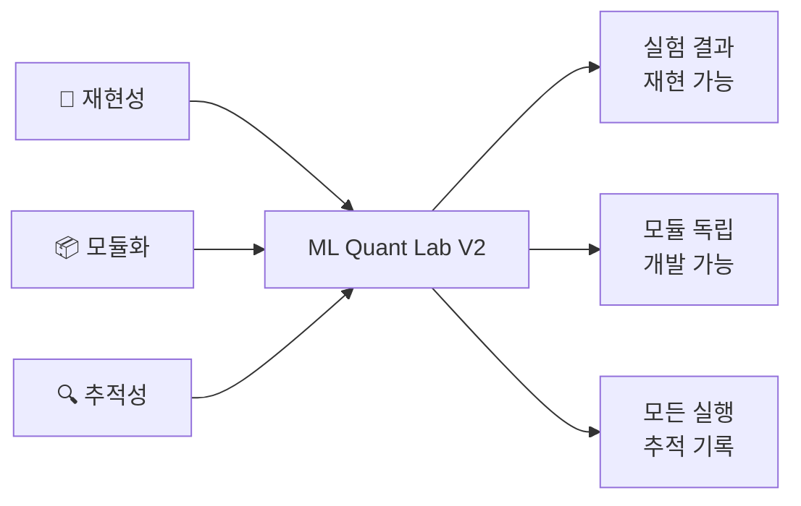
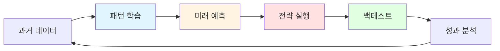
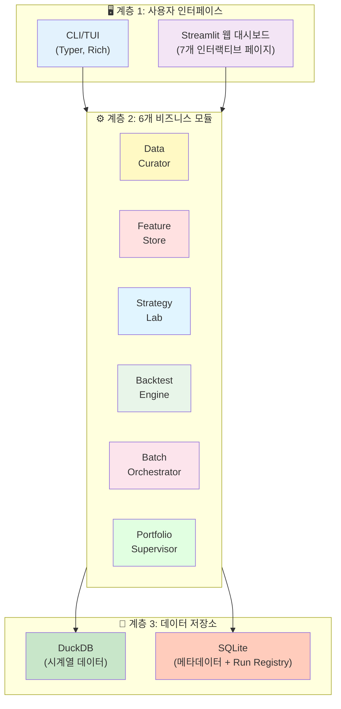
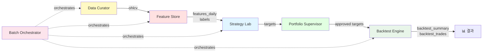
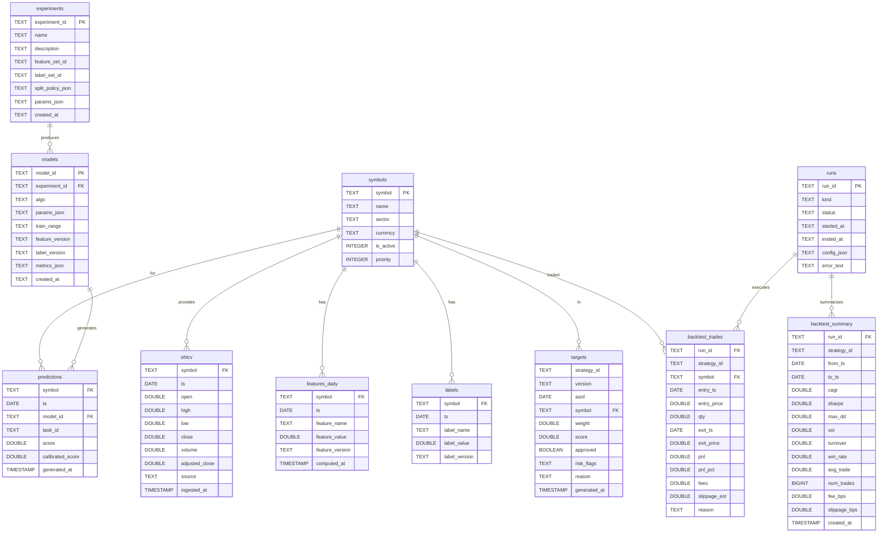
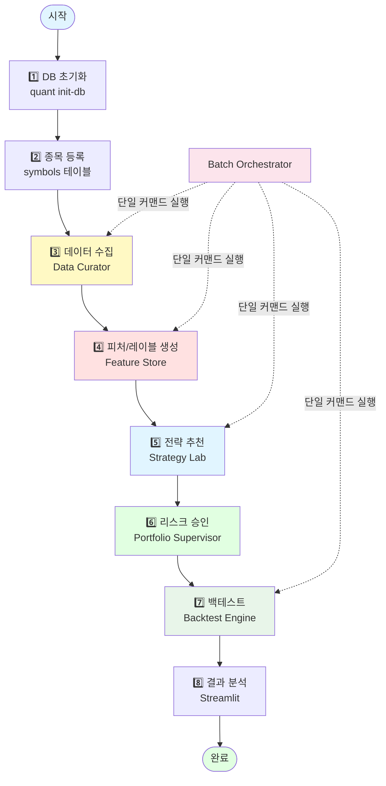
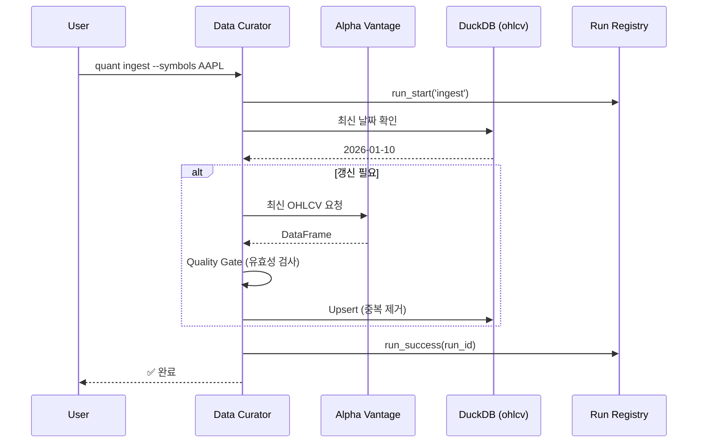
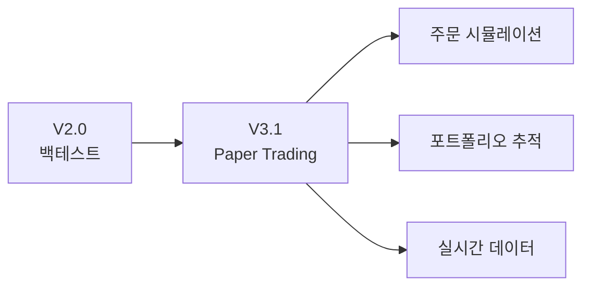

# 🤖 ML Quant Lab V2 - 종합 가이드

> **버전:** v2.0.0  
> **최초 작성일:** 2026-01-16  
> **최종 수정일:** 2026-01-17

**데이터 수집부터 AI 기반 예측, 전략 백테스팅까지 — 모듈 기반의 재현 가능한 퀀트 투자 실험 플랫폼**

> [!IMPORTANT]
> 본 문서는 금융/퀀트/머신러닝 비전문가인 일반 개발자도 프로젝트의 전체 구조와 기능을 이해할 수 있도록 작성되었습니다.

---

## 📑 목차

1. [프로젝트 소개](#-프로젝트-소개)
2. [V2의 주요 변화](#-v2의-주요-변화)
3. [핵심 개념 설명](#-핵심-개념-설명)
4. [시스템 아키텍처](#-시스템-아키텍처)
5. [데이터베이스 스키마 (ERD)](#-데이터베이스-스키마-erd)
6. [프로젝트 구조](#-프로젝트-구조)
7. [데이터 플로우](#-데이터-플로우)
8. [주요 기능 상세](#-주요-기능-상세)
9. [설치 및 환경 설정](#-설치-및-환경-설정)
10. [사용 가이드](#-사용-가이드)
11. [기술 스택](#-기술-스택)
12. [FAQ & 트러블슈팅](#-faq--트러블슈팅)
13. [향후 계획 (V3)](#-향후-계획-v3)

---

## 📖 프로젝트 소개

### 배경 및 목표

**ML Quant Lab**은 데이터 기반 투자 전략을 연구하고 검증하기 위한 올인원 플랫폼입니다. 

V2는 **프로덕션 팀 기반 워크플로우를 모듈 경계와 데이터 계약(Contract)으로 재현**하여, 개인 연구자부터 소규모 퀀트 팀까지 활용할 수 있는 재현 가능하고 확장 가능한 실험 환경을 제공합니다.

### 핵심 가치



1. **재현성 (Reproducibility)**: 동일한 입력으로 동일한 결과를 보장하는 버저닝 시스템
2. **모듈화 (Modularity)**: 6개 독립 모듈이 데이터 계약으로만 통신하는 구조
3. **추적성 (Traceability)**: 모든 CLI 실행이 Run Registry에 기록되어 감사 가능

---

## 🆕 V2의 주요 변화

V1에서 V2로 전환하면서 아래와 같은 핵심 개선이 이루어졌습니다:

| 영역            | V1                | V2                              |
| --------------- | ----------------- | ------------------------------- |
| **아키텍처**    | Service 계층 중심 | **6개 모듈 (팀) 기반 아키텍처** |
| **전략 정의**   | 코드 기반         | **YAML 조립 설정 파일**         |
| **실행 추적**   | 로그 파일         | **Run Registry (SQLite)**       |
| **데이터 저장** | DuckDB + SQLite   | **버저닝된 Long-form 스키마**   |
| **웹 UI**       | 3개 조회 페이지   | **7개 인터랙티브 페이지**       |
| **백테스트**    | 기본 시뮬레이션   | **Hold 정책, 상세 통계 지표**   |
| **파이프라인**  | 수동 단계별 실행  | **End-to-End 단일 커맨드**      |

> [!TIP]
> V2는 **실험 중심**의 설계로, Paper Trading과 Live Trading은 V3에서 추가될 예정입니다.

---

## ✅ V2 범위 선언 (UAT / 안정성 우선)

V2는 "성능"보다 **깨지지 않는 실행 계약(Contract)** 을 최우선으로 하는 UAT/Lab 플랫폼입니다.

- **실행의 실체는 CLI**: 모든 실행은 `quant pipeline run`을 기준으로 한다.
- **Run Contract 유지**: `--dry-run`은 실행(쓰기) 금지 + stdout에 `PLAN_JSON: {...}` 1줄 + `artifacts/runs/<run_id>/plan.json` 저장.
- **Artifacts SSOT**: 실행 산출물은 오직 `artifacts/runs/<run_id>/...` 아래로만 저장한다.
- **Stage 계약 고정**: `ingest → features → labels → recommend → backtest` (V2에서 stage 확장은 신중).

### Run ID(정체성) vs Run Slug(표시명)

- **`run_id`는 항상 UUID**이며 실행/재현/감사의 유일한 프로그램 식별자입니다. (변경 금지)
- 사람이 보기 좋은 이름은 **`run_slug` + `display_name`** 로 제공합니다.
  - `run.json`에 `run_slug`, `display_name`, `invoked_command`, `artifacts_dir`가 기록됩니다.
  - 별칭 인덱스는 `artifacts/index/runs/<run_slug>.json`로 생성되어 `run_id`를 가리킵니다.

예시 트리:

```text
artifacts/
  runs/
    <run_id>/
      run.json
      pipeline.log
      stages/
        recommend/
          result.json
          lightgbm.log
      models/
      reports/
      outputs/
  index/
    runs/
      <run_slug>.json
```

---

## 🧩 Recommender Engines: Baseline vs ML Plugin (V2 → V3 Bridge)

V2의 추천(recommend) 엔진은 **baseline을 절대 대체하지 않고**, 옵션 플러그인으로만 확장합니다.

| Engine        | 설정                             | 성격              | 학습                      | 출력(계약)                       | 아티팩트                                      |
| ------------- | -------------------------------- | ----------------- | ------------------------- | -------------------------------- | --------------------------------------------- |
| `factor_rank` | `signal.type=factor_rank` (기본) | 결정론적 baseline | 없음                      | `targets` (backtest 입력 그대로) | 최소(모델 없음)                               |
| `ml_gbdt`     | `recommender.type=ml_gbdt`       | POC 플러그인      | 시간축 split(train/valid) | **동일한 `targets` 계약 유지**   | `artifacts/runs/<run_id>/models/`, `reports/` |

### ML 플러그인(ml_gbdt) 설계 원칙

- **baseline `factor_rank`는 기본값이며 제거/변경 금지**
- ML은 `recommend` 내부의 **옵션 플러그인** (V2는 POC만)
- **랜덤 split 금지**: YAML의 `train_window`로 명시적 기간 분리
- 결과물은 기존 `targets` 테이블/스키마와 **완전히 호환** (downstream 변경 없음)

### 예시 커맨드

```bash
# Baseline
uv run quant pipeline run \
  --strategy strategies/example.yaml \
  --from 2024-01-01 --to 2024-01-31

# ML POC (GBDT)
uv run quant pipeline run \
  --strategy strategies/ml_gbdt_example.yaml \
  --from 2024-01-01 --to 2024-01-31 \
  --symbols AAPL,PLTR,QQQM
```

### ML POC 산출물(예)

- `artifacts/runs/<run_id>/models/model.<algo>.joblib`
- `artifacts/runs/<run_id>/reports/ml_metrics.json` (RMSE/MAE/RankIC/중요 피처)
- `artifacts/runs/<run_id>/reports/ml_summary.md`

---

## 🔭 V3 방향 (명시적 로드맵)

V3는 V2를 "연구 파이프라인"에서 "운영 시스템"으로 확장하는 단계입니다.

- (예) worker/scheduler, model registry, governance/품질 게이트, 배포/관제 고도화
- **단, V2의 목적은 계약/재현성/SSOT 안정화이며 baseline 유지가 전제**
- V2의 `ml_gbdt`는 V3 도입 전 **타당성/메트릭 검증을 위한 stepping stone** 입니다.

---

## 💡 핵심 개념 설명

> 금융/퀀트 용어가 생소한 개발자를 위한 간단한 용어 설명

### 퀀트 투자란?

**퀀트(Quantitative) 투자**는 수학적/통계적 모델을 사용하여 투자 의사결정을 내리는 방식입니다. 감정이나 직관이 아닌 **데이터와 알고리즘**에 기반합니다.



### 주요 용어 설명

| 용어                    | 설명                                                           | 예시                                               |
| ----------------------- | -------------------------------------------------------------- | -------------------------------------------------- |
| **OHLCV**               | Open(시가), High(고가), Low(저가), Close(종가), Volume(거래량) | 주식의 하루 가격 변동을 나타내는 5가지 기본 데이터 |
| **Feature (특성)**      | AI 모델이 학습할 입력 데이터                                   | 이동평균, 모멘텀, 변동성 등 기술적 지표            |
| **Label (레이블)**      | AI 모델이 예측할 목표값                                        | 60일 후 수익률, 상승/하락 방향                     |
| **Backtest (백테스트)** | 과거 데이터로 전략 성과를 시뮬레이션                           | 2024년에 이 전략을 썼다면 수익률은?                |
| **Target (타겟)**       | 전략이 추천하는 투자 포지션                                    | AAPL 30%, NVDA 40%, MSFT 30%                       |
| **Supervisor (감독)**   | 리스크 제어를 위한 규제 룰                                     | 단일 종목 최대 15%, 총 투자 100% 이내              |
| **CAGR**                | Compound Annual Growth Rate (연평균 성장률)                    | 3년간 30% 수익 → CAGR ≈ 9.1%                       |
| **Sharpe Ratio**        | 위험 대비 수익률 (높을수록 좋음)                               | 같은 수익률이라도 변동성이 적으면 Sharpe가 높음    |
| **MDD**                 | Maximum Drawdown (최대 낙폭)                                   | 최고점 대비 최대 몇 % 하락했는지 (위험도 지표)     |

### V2 고유 개념: 모듈 = 팀

V2는 **프로덕션 퀀트 팀의 역할 분담**을 모듈로 구현했습니다:

| 팀 (Book)       | 모듈 (Code)            | 핵심 책임                    |
| --------------- | ---------------------- | ---------------------------- |
| 데이터 큐레이터 | `data_curator`         | 데이터 수집/정합성 검증      |
| 특성 분석       | `feature_store`        | 피처/레이블 생성 및 버저닝   |
| 전략            | `strategy_lab`         | YAML 기반 전략 조립 및 추천  |
| 백테스터        | `backtest_engine`      | 전략 시뮬레이션 및 성과 측정 |
| 배치 조율       | `batch_orchestrator`   | 파이프라인 실행 순서 관리    |
| 포트폴리오 감독 | `portfolio_supervisor` | 리스크 규제 및 승인          |

---

## 🏗️ 시스템 아키텍처

### 전체 구조

V2는 **3계층 아키텍처**로 설계되었습니다:



### 데이터베이스 역할 분리

| DB         | 역할                          | 저장 데이터                                      | 접근 방식      |
| ---------- | ----------------------------- | ------------------------------------------------ | -------------- |
| **DuckDB** | 대용량 시계열 분석 (OLAP)     | OHLCV, 기술적 지표, 예측 결과, 백테스트 기록     | Raw SQL        |
| **SQLite** | 메타데이터 + 실행 추적 (OLTP) | 종목 정보, 실험 정의, 모델 레지스트리, 실행 로그 | SQLModel (ORM) |

> [!TIP]
> DuckDB는 OLAP(분석) 워크로드에 최적화되어 있어 수백만 건의 시계열 데이터를 빠르게 집계할 수 있습니다.

### 모듈별 데이터 계약



---

## 📊 데이터베이스 스키마 (ERD)

### DuckDB + SQLite 통합 ERD



> [!NOTE]
> ERD는 **DuckDB (시계열)**와 **SQLite (메타)** 테이블을 모두 포함합니다. 실제 DB는 분리되어 있지만, 논리적 관계를 보여주기 위해 통합 다이어그램으로 표현했습니다.

---

## 📂 프로젝트 구조

```
ml_quant/
│
├── 📄 README.md                    # 본 문서
├── 📄 README_v1.md                 # V1 백업 문서
├── 📄 pyproject.toml               # 프로젝트 의존성 및 설정
│
├── 📁 docs/                        # 문서
│   └── 📁 implementation/v2/       # V2 구현 문서
│       ├── V2_SYSTEM_SPEC.md       # 시스템 SSOT
│       ├── DB_SCHEMA.md            # 데이터베이스 스키마 정의
│       ├── IMPLEMENTATION_PLAN.md  # 구현 계획
│       ├── RUNBOOK.md              # 운영 가이드
│       ├── YAML_SCHEMA.md          # 전략 YAML 스키마
│       ├── 📁 plan/                # Phase별 구현 계획
│       └── 📁 walkthrough/         # Phase별 완료 보고서
│
├── 📁 src/quant/                   # 핵심 비즈니스 로직
│   ├── cli.py                      # CLI 명령어 정의 (Typer)
│   ├── interactive.py              # TUI 대화형 메뉴 (InquirerPy)
│   ├── config.py                   # 환경 설정
│   ├── logging.py                  # 로깅 설정
│   │
│   ├── 📁 data_curator/            # 데이터 수집 및 품질 관리
│   │   ├── ingest.py               # Alpha Vantage 데이터 수집
│   │   ├── provider.py             # API Provider 래퍼
│   │   └── quality_gate.py         # 데이터 품질 검증
│   │
│   ├── 📁 feature_store/           # 피처/레이블 생성 및 버저닝
│   │   ├── generator.py            # 피처 생성기
│   │   └── label_generator.py      # 레이블 생성기
│   │
│   ├── 📁 strategy_lab/            # 전략 조립 및 추천
│   │   ├── yaml_loader.py          # YAML 전략 파일 로딩
│   │   ├── recommender.py          # Top-K 추천 로직
│   │   └── strategy_files.py       # 전략 파일 관리
│   │
│   ├── 📁 portfolio_supervisor/    # 리스크 규제 및 승인
│   │   └── supervisor.py           # 5가지 규제 룰 적용
│   │
│   ├── 📁 backtest_engine/         # 백테스트 시뮬레이션
│   │   └── engine.py               # 백테스트 실행 엔진
│   │
│   ├── 📁 batch_orchestrator/      # 파이프라인 실행 관리
│   │   └── pipeline.py             # End-to-End 파이프라인
│   │
│   ├── 📁 db/                      # 데이터베이스 레이어
│   │   ├── duck.py                 # DuckDB 연결 헬퍼
│   │   ├── sqlite.py               # SQLite 연결 헬퍼
│   │   ├── engine.py               # SQLModel 엔진 설정
│   │   └── schema_duck.sql         # DuckDB 스키마 정의
│   │
│   ├── 📁 models/                  # SQLModel 데이터 모델
│   │   ├── meta.py                 # Symbol, Experiment, Model, Run
│   │   └── ml.py                   # ML 관련 모델 (미사용)
│   │
│   ├── 📁 repos/                   # Repository 패턴 (데이터 접근)
│   │   ├── symbol.py               # 종목 CRUD
│   │   ├── run_registry.py         # Run 실행 로그
│   │   ├── targets.py              # Target 저장/조회
│   │   └── experiment.py           # 실험 관리
│   │
│   ├── 📁 features/                # Feature Engineering
│   │   └── technical.py            # 기술적 지표 계산
│   │
│   ├── 📁 labels/                  # Label 생성
│   │   └── returns.py              # Forward Return 계산
│   │
│   ├── 📁 ml/                      # 머신러닝 유틸리티
│   │   ├── splits.py               # 시계열 Train/Test 분할
│   │   └── experts.py              # 시장 국면(Bull/Bear) 탐지
│   │
│   └── 📁 ui/                      # Streamlit 공통 유틸
│       ├── data_access.py          # DB 조회 함수
│       └── charts.py               # 차트 생성 유틸
│
├── 📁 app/                         # Streamlit 웹 대시보드
│   ├── main.py                     # 메인 페이지 엔트리
│   └── 📁 pages/
│       ├── 1_Dashboard.py          # 시스템 대시보드
│       ├── 2_Run_Center.py         # 실행 로그 및 상태
│       ├── 3_Data_Center.py        # 데이터 현황
│       ├── 4_Feature_Lab.py        # 피처 생성 및 조회
│       ├── 5_Strategy_Lab.py       # 전략 선택 및 실행
│       ├── 6_Backtest_Lab.py       # 백테스트 실행 및 비교
│       └── 7_Targets_Analyzer.py   # 추천 포지션 분석
│
├── 📁 strategies/                  # YAML 전략 정의 파일
│   └── example.yaml                # 예시 전략
│
├── 📁 data/                        # 데이터베이스 파일
│   ├── quant.duckdb                # DuckDB 시계열 데이터
│   └── meta.db                     # SQLite 메타데이터
│
├── 📁 models/                      # 학습된 모델 저장 (.joblib)
│
├── 📁 artifacts/                   # Phase별 산출물 스냅샷
│   ├── README.md                   # 인덱스
│   └── 📁 runs/                    # 실행별 증거 파일
│
└── 📁 tests/                       # 테스트
    └── test_e2e_ingest.py          # E2E 테스트
```

---

## 🔄 데이터 플로우

### V2 모듈 기반 파이프라인



### 모듈별 상세 역할

#### 1️⃣ Data Curator (데이터 큐레이터)

**역할**: 외부 API에서 데이터를 수집하고 품질을 검증하여 DuckDB에 저장



**주요 기능:**
- 증분 업데이트 (최신 날짜 이후만 수집)
- Rate Limit 관리 (Tenacity 기반 재시도)
- Quality Gate (NaN 비율, 가격 양수 검증 등)

#### 2️⃣ Feature Store (특성 저장소)

**역할**: OHLCV 데이터에서 기술적 지표를 계산하고 버저닝하여 저장

**생성되는 Feature 예시:**
```python
# 모멘텀 지표
- ret_5d, ret_20d, ret_60d     # 기간별 수익률
- rsi_14                        # 상대강도지수

# 변동성 지표
- bb_upper, bb_lower            # 볼린저밴드
- atr_14                        # 평균 진폭

# 거래량 지표
- volume_ratio_20               # 거래량 비율
```

**버저닝 예시:**
```sql
SELECT DISTINCT feature_version 
FROM features_daily;
-- 결과: ['v1', 'v2_winsorized']
```

#### 3️⃣ Strategy Lab (전략 실험실)

**역할**: YAML 파일 기반으로 전략을 조립하고 Top-K 추천 생성

**YAML 전략 예시:**
```yaml
strategy_id: "momentum_v1"
version: "1.0.0"

universe:
  type: "symbols"
  symbols: ["AAPL", "MSFT", "NVDA", "GOOGL", "META"]

signal:
  type: "factor_rank"
  inputs:
    feature_version: "v1"
    feature_name: "ret_20d"

portfolio:
  top_k: 3
  weighting: "equal"

supervisor:
  gross_exposure_cap: 1.0
  max_weight_per_symbol: 0.40
  max_positions: 3
```

#### 4️⃣ Portfolio Supervisor (포트폴리오 감독)

**역할**: 전략이 생성한 Target에 대해 리스크 규제를 적용

**5가지 규제 룰:**

| Rule                        | 설명                   | 기본값       |
| --------------------------- | ---------------------- | ------------ |
| **R1: Gross Exposure Cap**  | 총 투자 비중 상한      | 1.0 (100%)   |
| **R2: Max Position Weight** | 단일 종목 최대 비중    | 0.15 (15%)   |
| **R3: Max Positions**       | 동시 보유 종목 수 제한 | 10개         |
| **R4: Turnover Cap**        | 리밸런싱 교체량 제한   | 0.30 (30%)   |
| **R5: Score Floor**         | 최소 점수 기준         | Top-K만 허용 |

**출력:**
```sql
SELECT symbol, weight, approved, risk_flags 
FROM targets 
WHERE strategy_id = 'momentum_v1' AND asof = '2025-12-31';

-- 결과:
-- AAPL  | 0.33 | true  | null
-- NVDA  | 0.33 | true  | null
-- MSFT  | 0.33 | true  | null
-- GOOGL | 0.25 | false | "R2:max_weight_exceeded"
```

#### 5️⃣ Backtest Engine (백테스트 엔진)

**역할**: 과거 데이터로 전략을 시뮬레이션하고 성과 지표 계산

**체결 가정:**
- 체결 가격: **Daily Close**
- 체결 시점: 리밸런싱 날짜(T)의 종가
- 수익률 반영: T+1일부터
- 비용: `fee_bps` + `slippage_bps` (YAML에서 설정)

**계산 지표:**
```python
- CAGR (연평균 성장률)
- Sharpe Ratio (위험 대비 수익)
- Max Drawdown (최대 낙폭)
- Volatility (일별 수익 표준편차)
- Win Rate (승률)
- Turnover (회전율)
```

**Hold 정책:**
> 특정 날짜에 승인된 Target이 없으면 직전 포트폴리오를 그대로 유지

#### 6️⃣ Batch Orchestrator (배치 조율자)

**역할**: 전체 파이프라인을 단일 커맨드로 실행

```bash
uv run quant pipeline run \
  --strategy strategies/momentum_v1.yaml \
  --from 2024-01-01 \
  --to 2025-12-31
```

**실행 순서:**
1. `quant ingest`
2. `quant features`
3. `quant labels`
4. `quant recommend`
5. `quant backtest`

**Fail-Fast:** 어느 단계든 실패 시 즉시 중단하고 `runs` 테이블에 에러 기록

---

## 🚀 주요 기능 상세

### 멀티 인터페이스

#### 1. CLI (Command Line Interface)

```bash
# DB 초기화
uv run quant init-db

# 데이터 수집
uv run quant ingest --symbols AAPL MSFT

# 피처 생성
uv run quant features --feature-version v1

# 레이블 생성
uv run quant labels --label-version v1 --horizon 60

# 전략 추천
uv run quant recommend --strategy strategies/momentum_v1.yaml --asof 2025-12-31

# 백테스트
uv run quant backtest --strategy strategies/momentum_v1.yaml --from 2024-01-01 --to 2025-12-31

# 파이프라인 실행 (End-to-End)
uv run quant pipeline run --strategy strategies/momentum_v1.yaml --from 2024-01-01 --to 2025-12-31
```

#### 2. Interactive TUI (Terminal UI)

```bash
uv run quant  # 또는 uv run quant ui
```

**제공 기능:**
- 명령어 외울 필요 없이 메뉴 선택
- Rich 라이브러리 기반 컬러풀한 UI
- 실시간 Progress Bar

#### 3. Streamlit 웹 대시보드

```bash
streamlit run app/main.py
```

**7개 페이지:**

| 페이지                  | 역할             | 주요 기능                          |
| ----------------------- | ---------------- | ---------------------------------- |
| **1. Dashboard**        | 시스템 전체 현황 | 최신 실행 로그, 데이터 현황 요약   |
| **2. Run Center**       | 실행 추적        | `runs` 테이블 조회, 성공/실패 로그 |
| **3. Data Center**      | 데이터 모니터링  | 종목별 최신 날짜, OHLCV 차트       |
| **4. Feature Lab**      | 피처 조회        | 버전별 피처 비교, 분포 분석        |
| **5. Strategy Lab**     | 전략 선택/실행   | YAML 선택, 추천 트리거             |
| **6. Backtest Lab**     | 백테스트 비교    | run별 성과 비교, Equity Curve      |
| **7. Targets Analyzer** | 포지션 분석      | 승인된 Target 조회, 시계열 비교    |

> [!WARNING]
> Streamlit은 **읽기 전용** 모드로 동작합니다. 데이터 수정은 CLI에서만 가능합니다. 배치 실행 시 Streamlit을 종료해야 DB Lock을 피할 수 있습니다.

### Run Registry (실행 추적)

모든 CLI 실행은 자동으로 `runs` 테이블에 기록됩니다:

```sql
SELECT run_id, kind, status, started_at, ended_at, error_text
FROM runs
ORDER BY started_at DESC
LIMIT 5;
```

결과 예시:
```
| run_id                               | kind      | status  | started_at          | error_text  |
| ------------------------------------ | --------- | ------- | ------------------- | ----------- |
| a1b2c3d4-e5f6-7890-abcd-ef1234567890 | backtest  | success | 2026-01-16 10:30:15 | null        |
| b2c3d4e5-f6a7-8901-bcde-f12345678901 | recommend | success | 2026-01-16 10:25:42 | null        |
| c3d4e5f6-a7b8-9012-cdef-123456789012 | ingest    | failed  | 2026-01-16 10:20:11 | API timeout |
```

---

## ⚙️ 설치 및 환경 설정

### 시스템 요구사항

- **Python**: 3.11 이상
- **OS**: macOS, Linux, Windows
- **메모리**: 최소 4GB (대용량 데이터 처리 시 8GB+ 권장)

### 설치 방법

#### 1. 저장소 클론

```bash
git clone https://github.com/your-username/ml-quant-lab.git
cd ml-quant-lab
```

#### 2. 가상환경 설정 (uv 사용)

```bash
# uv 설치 (없는 경우)
curl -LsSf https://astral.sh/uv/install.sh | sh

# 의존성 설치
uv sync
```

#### 3. 환경 변수 설정

`.env.example`을 복사하여 `.env` 파일 생성:

```bash
cp .env.example .env
```

`.env` 파일 수정:

```bash
ALPHA_VANTAGE_API_KEY=your_api_key_here
QUANT_DATA_DIR=./data
QUANT_LOG_LEVEL=INFO
```

> [!TIP]
> Alpha Vantage API 키는 [alphavantage.co](https://www.alphavantage.co/support/#api-key)에서 무료로 발급받을 수 있습니다.

#### 4. 데이터베이스 초기화

```bash
uv run quant init-db
```

이 명령어는:
- DuckDB 스키마 생성 (`data/quant.duckdb`)
- SQLite 테이블 생성 (`data/meta.db`)
- 초기화 실행을 `runs` 테이블에 기록

#### 5. 종목 등록

```bash
# SQLite에 종목 추가 (CLI 미구현 시 DBeaver 등 GUI 도구 사용)
# 예시: INSERT INTO symbols (symbol, is_active, priority) VALUES ('AAPL', 1, 1);
```

---

## 📖 사용 가이드

### 전체 워크플로우 예시

#### Step 1: 데이터 수집

```bash
uv run quant ingest --symbols AAPL MSFT NVDA
```

**내부 동작:**
1. SQLite에서 활성 종목 확인
2. DuckDB에서 최신 날짜 조회
3. Alpha Vantage API로 갱신 필요한 데이터 요청
4. Quality Gate 통과 후 DuckDB `ohlcv`에 저장
5. `runs` 테이블에 성공/실패 기록

#### Step 2: 피처/레이블 생성

```bash
# 피처 생성
uv run quant features --feature-version v1

# 레이블 생성 (60일 후 수익률)
uv run quant labels --label-version v1 --horizon 60
```

**결과:**
- `features_daily` 테이블에 `feature_version='v1'` 데이터 저장
- `labels` 테이블에 `label_version='v1'` 데이터 저장

#### Step 3: 전략 정의 (YAML)

`strategies/my_strategy.yaml` 생성:

```yaml
strategy_id: "my_momentum_strategy"
version: "1.0.0"

universe:
  type: "symbols"
  symbols: ["AAPL", "MSFT", "NVDA"]

signal:
  type: "factor_rank"
  inputs:
    feature_version: "v1"
    feature_name: "ret_20d"

rebalance:
  frequency: "weekly"

portfolio:
  top_k: 2
  weighting: "equal"

supervisor:
  gross_exposure_cap: 1.0
  max_weight_per_symbol: 0.50
  max_positions: 2

execution:
  price: "close"

backtest:
  from: "2024-01-01"
  to: "2025-12-31"
  fee_bps: 5
  slippage_bps: 10
```

#### Step 4: 추천 생성

```bash
uv run quant recommend --strategy strategies/my_strategy.yaml --asof 2025-12-31
```

**출력:**
```
Strategy: my_momentum_strategy
As of: 2025-12-31

Approved Targets:
┏━━━━━━━┳━━━━━━━━┳━━━━━━━━━┳━━━━━━━━━━━┓
┃ Symbol┃ Weight ┃ Approved┃ Risk Flags┃
┡━━━━━━━╇━━━━━━━━╇━━━━━━━━━╇━━━━━━━━━━━┩
│ NVDA  │ 0.50   │ ✅      │           │
│ AAPL  │ 0.50   │ ✅      │           │
└───────┴────────┴─────────┴───────────┘
```

#### Step 5: 백테스트 실행

```bash
uv run quant backtest --strategy strategies/my_strategy.yaml --from 2024-01-01 --to 2025-12-31
```

**출력:**
```
Backtest Summary:
Run ID: a1b2c3d4-e5f6-7890-abcd-ef1234567890

┏━━━━━━━━━━━━━┳━━━━━━━━━┓
┃ Metric      ┃ Value   ┃
┡━━━━━━━━━━━━━╇━━━━━━━━━┩
│ CAGR        │ 12.5%   │
│ Sharpe      │ 1.23    │
│ Max DD      │ -8.2%   │
│ Volatility  │ 18.4%   │
│ Win Rate    │ 58.3%   │
│ Num Trades  │ 52      │
└─────────────┴─────────┘
```

#### Step 6: 단일 커맨드 실행 (파이프라인)

```bash
uv run quant pipeline run \
  --strategy strategies/my_strategy.yaml \
  --from 2024-01-01 \
  --to 2025-12-31 \
  --symbols AAPL MSFT NVDA
```

**장점:**
- 모든 단계를 자동으로 순차 실행
- 중간 단계 실패 시 즉시 중단
- 단일 `run_id`로 전체 파이프라인 추적

#### Step 7: Streamlit에서 결과 확인

```bash
streamlit run app/main.py
```

브라우저에서 `http://localhost:8501` 접속:
- **Backtest Lab**: 여러 전략 성과 비교
- **Targets Analyzer**: 승인된 포지션 시계열 조회
- **Run Center**: 파이프라인 실행 로그 확인

---

## 🔧 기술 스택

### 언어 & 프레임워크

| 기술          | 버전  | 용도           |
| ------------- | ----- | -------------- |
| **Python**    | 3.11+ | 메인 언어      |
| **Typer**     | 0.12+ | CLI 프레임워크 |
| **Rich**      | 13.7+ | 터미널 시각화  |
| **Streamlit** | 1.36+ | 웹 대시보드    |

### 데이터 처리

| 기술         | 용도                            |
| ------------ | ------------------------------- |
| **Pandas**   | DataFrame 기반 데이터 처리      |
| **NumPy**    | 수치 계산                       |
| **DuckDB**   | OLAP 데이터베이스 (시계열 집계) |
| **SQLite**   | OLTP 데이터베이스 (메타데이터)  |
| **SQLModel** | ORM (SQLAlchemy + Pydantic)     |

### 설정 & 유틸리티

| 기술                  | 용도            |
| --------------------- | --------------- |
| **Pydantic Settings** | 환경 변수 관리  |
| **python-dotenv**     | .env 파일 로딩  |
| **Tenacity**          | API 재시도 로직 |
| **PyYAML**            | YAML 파일 파싱  |

---

## ❓ FAQ & 트러블슈팅

### Q1. DuckDB와 SQLite를 왜 둘 다 사용하나요?

**A:**
- **DuckDB**: 시계열 집계 쿼리에 최적화 (OLAP). 수백만 건 데이터도 빠름.
- **SQLite**: 트랜잭션 처리에 최적화 (OLTP). 종목 정보 같은 메타데이터 관리.

각 DB의 강점을 활용하여 성능을 극대화했습니다.

### Q2. V1과 V2의 가장 큰 차이는?

**A:**
1. **모듈 아키텍처**: V1은 Service 계층 중심, V2는 6개 독립 모듈
2. **전략 정의**: V1은 코드, V2는 YAML 조립 설정
3. **실행 추적**: V1은 로그 파일, V2는 Run Registry (DB)
4. **재현성**: V2는 버저닝 시스템으로 동일 입력 → 동일 결과 보장

### Q3. Streamlit과 CLI를 동시에 사용하면 DB Lock이 발생하나요?

**A:** 
- Streamlit은 `read_only=True`로 DuckDB에 접근하여 **읽기만** 수행합니다.
- 하지만 배치 작업(ingest/features/backtest) 실행 시에는 **Streamlit을 종료**하는 것을 권장합니다.

### Q4. YAML 전략 파일에 복잡한 로직을 넣을 수 있나요?

**A:** 
**아니오.** V2 설계에서 YAML은 **조립 설정 전용**입니다. 
- ✅ 허용: 파라미터 설정 (`top_k: 3`, `fee_bps: 5`)
- ❌ 금지: 조건식, 수식, 반복문 (`if score > 0.5 then ...`)

복잡한 로직은 Python 모듈로 구현하고 YAML에서 참조만 해야 합니다.

### Q5. 백테스트 결과를 어떻게 해석하나요?

**A:**
- **CAGR > 10%**: 우수 (미국 S&P 500 장기 평균 ≈ 10%)
- **Sharpe > 1.0**: 좋음 (위험 대비 수익이 양호)
- **MDD < 20%**: 안정적 (낙폭이 작음)

> [!CAUTION]
> 과거 성과가 미래를 보장하지 않습니다!

### 트러블슈팅

#### 문제: `quant` 명령어를 찾을 수 없음

```bash
# 해결: uv run 사용
uv run quant init-db
```

#### 문제: API 키 오류

```bash
# KeyError: 'ALPHA_VANTAGE_API_KEY'
# 해결: .env 파일 확인
cat .env
```

#### 문제: DuckDB Lock 에러

```bash
# 해결: Streamlit 종료 후 CLI 실행
# 또는 별도 터미널에서 실행
```

#### 문제: 백테스트에서 NaN Sharpe Ratio

**원인:** 데이터 포인트가 2개 미만이거나 변동성이 0
**해결:** 백테스트 기간을 늘리거나 리밸런싱 빈도 조정

---

## 🗺️ 향후 계획 (V3)

V2는 **실험 중심**의 백테스트 플랫폼입니다. V3에서는 실거래 지원을 추가합니다:

### Phase V3.1: Paper Trading (모의 거래)



**세부 계획:**

| 기능                | 설명                                 |
| ------------------- | ------------------------------------ |
| **주문 시뮬레이션** | Broker API 없이 주문 로직 검증       |
| **실시간 추적**     | WebSocket 기반 실시간 가격 수신      |
| **성과 모니터링**   | Streamlit에서 실시간 포트폴리오 현황 |

### Phase V3.2: Live Trading (실거래)

> [!WARNING]
> **실거래는 자본 손실 위험이 있습니다.** V3.2는 충분한 검증 후에만 제공됩니다.

**세부 계획:**

| 기능            | 설명                            |
| --------------- | ------------------------------- |
| **Broker 연동** | Alpaca, Interactive Brokers API |
| **주문 실행**   | 리밸런싱 자동화                 |
| **Kill Switch** | 비정상 상황 시 즉시 중단        |
| **감사 추적**   | 모든 주문 내역 DB 기록          |

### Phase V3.3: 고급 기능

- **멀티 애셋**: 주식 외 암호화폐, FX, ETF 지원
- **고급 모델**: LSTM, Transformer 기반 예측
- **뉴스 분석**: NLP 기반 감성 분석
- **클라우드 배포**: AWS/GCP 자동 스케줄링

---

## 📜 라이센스 & 기여

### 라이센스
MIT License (상업적 사용 가능)

### 기여 방법
1. Fork this repository
2. Create your feature branch (`git checkout -b feature/amazing`)
3. Commit your changes (`git commit -m 'Add amazing feature'`)
4. Push to the branch (`git push origin feature/amazing`)
5. Open a Pull Request

---

## 📞 연락처

**프로젝트 관리자:** MySingle Quant Team  
**이슈 보고:** [GitHub Issues](https://github.com/your-repo/ml-quant-lab/issues)  
**문의:** daniel@mysingle.io

---

> [!CAUTION]
> **투자 면책 조항**
> 
> 본 시스템이 제공하는 예측 정보는 **참고용**이며 투자 권유가 아닙니다.  
> 실제 투자로 인한 손실 책임은 전적으로 사용자에게 있습니다.  
> V2는 백테스트 전용이며, 실거래 기능은 V3에서 추가될 예정입니다.

---

**마지막 업데이트:** 2026-01-17  
**문서 버전:** v2.0.0
