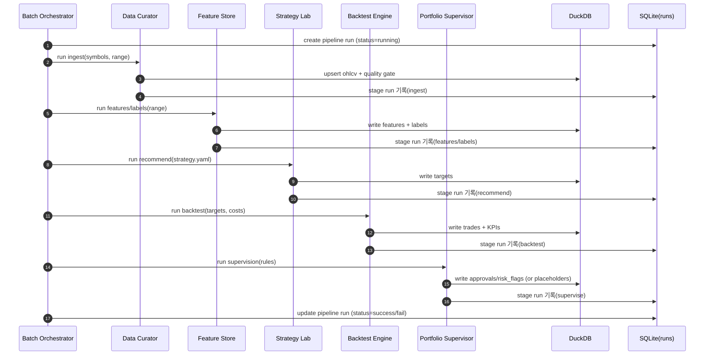

# Quant Lab V2 — 생산체인(Production Chain) 기반 역할 분담 정의서

- 작성자: Harvey (하비)
- 대상: Dan (댄) — Quant Lab V2 설계/운영
- 작성일: 2026-01-16
- 목적: V2 모듈을 **프로덕션 퀀트 팀의 역할 분담**(production chain) 관점으로 정리하고,  
  각 팀이 **어떤 입력을 받아 무엇을 생산**하며 **어느 팀으로 핸드오버**하는지 비즈니스 용어로 명확히 한다.

---

## 0) 전체 개요

V2는 “아이디어 → 데이터 → 피처 → 전략 → 추천 → 백테스트 → 승인/감독 → (향후 실행)”의 흐름을  
**모듈(랩) 단위로 분리**해 구현했다.

- **DuckDB**: 시계열/대량 데이터(OHLCV, features, labels, targets, backtest 결과)
- **SQLite**: 실행이력/메타데이터(runs 등)
- **YAML**: 전략 조립용 설정(DSL 확장 금지)

---

## 1) 생산체인 Flow (High-Level)

```mermaid
flowchart LR
  A[Data Curator (data_curator)] -->|OHLCV + Quality Gate| B[Feature Lab (feature_store)]
  B -->|Features/Labels| C[Strategy Lab (strategy_lab)]
  C -->|Targets (추천 포지션)| D[Backtester (backtest_engine)]
  D -->|Backtest KPIs + Trades| E[Portfolio Supervisor (portfolio_supervisor)]
  E -->|Approved Targets / Risk Flags| C
  F[Batch Orchestrator (batch_orchestrator)] -.->|triggers| A
  F -.->|triggers| B
  F -.->|triggers| C
  F -.->|triggers| D
  F -.->|triggers| E
```

---

## 2) 팀(모듈)별 책임 정의 (핵심 표)

> **KPI는 “성과지표”이자 “품질지표”다.**  
> V2에서 KPI는 *팀 간 책임 경계*를 명확히 하기 위한 계약으로도 사용한다.

| 순서 | 팀(Book) | 모듈(Code) | 목적(Purpose) | 목표(Objective) | 전문분야(Discipline) | 입력(Inputs) | 수행(What they do) | 주요 산출물(Outputs/Artifacts) | 핸드오버(To) | KPI (Quality/Success) |
|---:|---|---|---|---|---|---|---|---|---|---|
| 1 | 데이터 큐레이터 | `data_curator` | **신뢰 가능한 시장데이터 공급** | 누락/중복/오염 없는 OHLCV 적재 | Data Engineering / Market Data Ops | Alpha Vantage 응답, symbol registry, ingest config | 수집, 리트라이/백오프, 증분 적재(upsert), 품질 게이트(Quality Gate) | DuckDB `ohlcv`, ingest run logs, quality report | Feature Store | 커버리지(%), 중복률(0%), invalid price(0), 지연(latency), ingest 성공률 |
| 2 | 특성 분석 | `feature_store` | **학습/전략에 유의미한 신호 재료 생산** | 피처/레이블 생성 및 재현성 확보 | Feature Engineering / Data Science | DuckDB `ohlcv`, feature spec(프리셋), date range | 지표 계산, 정규화/윈도우링, 결측 처리, 레이블 생성, 버저닝(논리적) | DuckDB `features`, `labels`, feature summary | Strategy Lab | 피처 결측률, 분산/드리프트, 상관쏠림, 라벨 누수(leakage) 0, 생성 성공률 |
| 3 | 전략 | `strategy_lab` | **전략 조립 + 추천(의사결정 초안) 생성** | YAML 기반 전략 구성과 추천 결과 생성 | Quant Research / Portfolio Construction(초기) | features/labels, YAML 전략파일, constraints, universe | 전략 검증(YAML schema), 추천 산출(targets), 실험 실행 연결 | DuckDB `targets` (score/weights), strategy summary, run config | Backtester / Supervisor | 추천 재현성, turnover 수준, constraint 위반 0, top-k precision(선택) |
| 4 | 백테스터 | `backtest_engine` | **전략 성과 검증 및 리스크/비용 반영** | KPI 계산, 트레이드 경로 재현 | Backtesting / Risk Analytics | targets, ohlcv, 비용(수수료/슬리피지), 기간 | 시뮬레이션, 포지션/현금흐름, KPI 산출, 트레이드 로그 생성 | DuckDB backtest tables, KPI summary, trade list | Portfolio Supervisor / Dashboard | Sharpe, CAGR, MDD, turnover, hit rate, 비용 반영 후 net PnL |
| 5 | 배치 조율 | `batch_orchestrator` | **생산체인 실행의 신뢰성/반복성 확보** | 단계별 순서/실행 이력/실패 처리 | Batch/Orchestration / DevOps-lite | stage list, YAML 전략, date range, symbols | pipeline run, stage run, fail-fast, dry-run plan | SQLite `runs`, artifacts/logs, execution report | 모든 팀 | 성공률, 평균 실행시간, 실패 원인 식별성(error_text 품질), 재실행 가능성 |
| 6 | 포트폴리오 감독 | `portfolio_supervisor` | **리스크 규제/승인으로 운영 안전성 확보** | 추천안 승인/거절 + 리스크 체크 | Risk Management / Governance | targets, backtest KPIs, risk rules | 규제 검증(제약조건/리스크), 승인상태 관리, 예외 처리 | approved targets, risk flags, approval log | Strategy Lab / (향후 Execution) | constraint 위반 0, 승인율, 리스크 한도 초과 0, 사고율(운영) |

---

## 3) 팀 간 “핸드오버 계약(Contracts)” 정의

> 각 핸드오버는 “테이블/아티팩트/메타데이터”로 고정되며,  
> 하위 팀은 상위 팀 출력의 품질을 **가정하고 최적화**한다.

### 3.1 Data Curator → Feature Store
- **계약 데이터**
  - DuckDB `ohlcv`
- **계약 품질**
  - 중복/누락/invalid price 최소화
  - 증분 적재 재현성 (같은 입력이면 같은 결과)
- **실패 시 대응**
  - quality gate failure → downstream 실행 차단(또는 경고)

### 3.2 Feature Store → Strategy Lab
- **계약 데이터**
  - DuckDB `features`, `labels`
- **계약 품질**
  - look-ahead leakage 0
  - feature schema 안정성(컬럼 변화는 controlled)
- **핸드오버 산출물**
  - feature summary artifact(결측/상관/드리프트)

### 3.3 Strategy Lab → Backtester
- **계약 데이터**
  - DuckDB `targets` (weights/score)
- **계약 품질**
  - constraints 준수(최소 규제)
  - universe/symbol 존재 보장
- **실패 시 대응**
  - 추천 생성 실패는 backtest 금지

### 3.4 Backtester → Portfolio Supervisor
- **계약 데이터**
  - backtest KPI summary + trades
- **계약 품질**
  - 비용 반영 후 성과 측정(수수료/슬리피지)
  - KPI 계산 공식 일관성
- **핸드오버 산출물**
  - “승인 판단 가능한 요약 리포트”

### 3.5 Portfolio Supervisor → Strategy Lab (Feedback Loop)
- **계약 데이터**
  - 승인 여부(approved) + risk flags
- **계약 품질**
  - 승인 근거(reason) 기록
- **목적**
  - 전략 개선을 위한 규제 피드백 루프 형성

---

## 4) 시퀀스 다이어그램 (E2E 실행 관점)



---

## 5) “주요 산출물” 표준 패키징 (Artifacts)

> 모듈별 산출물은 최종적으로 **UAT/디버깅/재현**을 위해 아티팩트 폴더로 남긴다.

- 기본 규약(권장):
  - `artifacts/runs/<run_id>/pipeline.log`
  - `artifacts/runs/<run_id>/summary.json`
  - `artifacts/runs/<run_id>/reports/*.md`

모듈별 최소 산출물 권장:
- Data Curator: `quality_report.md`
- Feature Store: `feature_profile.md` (missing/corr/drift)
- Strategy Lab: `strategy_summary.md` (universe/constraints)
- Backtester: `backtest_summary.md` + `trades.csv`
- Supervisor: `approval_summary.md`
- Orchestrator: `walkthrough.md`

---

## 6) 경영진/비즈니스 커뮤니케이션용 요약 (1문장씩)

- **데이터 큐레이터**: “시장 데이터를 신뢰 가능한 형태로 정제/적재해 downstream 분석의 기반을 만든다.”
- **특성 분석팀**: “전략과 학습에 필요한 피처/레이블을 표준화해 신호 생산성을 높인다.”
- **전략팀**: “전략 설정(YAML)을 조립하고 추천 포지션을 산출해 의사결정 초안을 만든다.”
- **백테스터팀**: “비용과 리스크를 반영해 전략의 실질 성과를 검증하고 비교가능한 KPI를 낸다.”
- **배치팀**: “전체 생산체인을 반복/재현 가능하게 돌리고 실패 원인을 추적 가능하게 만든다.”
- **포트폴리오 감독팀**: “리스크 규제와 승인 프로세스로 전략 운용의 안전성을 확보한다.”

---

## 7) V2 범위와 V3 확장 포인트

- V2: 연구/실험 워크벤치 중심 (UAT 완료가 목표)
- V3: Paper/Live Trading + Worker 기반 배치 자동화 + 운영 안정성 강화

