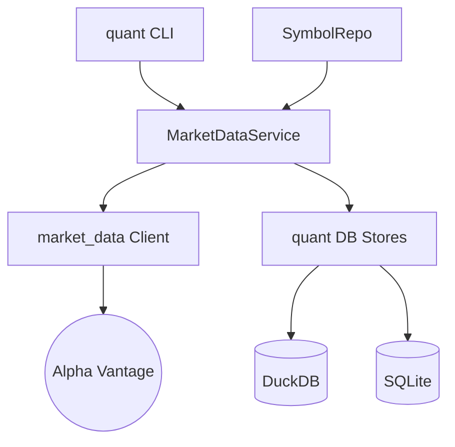

# Walkthrough: 마켓 데이터 수집 및 저장 계층 분리 완료

본 레포트는 `market_data` 라이브러리의 역할을 단순화하고, 데이터베이스 관리 및 비즈니스 로직을 `src/quant`로 이관하여 시스템 아키텍처를 고도화한 결과를 요약합니다.

## 1. 주요 개선 사항

### 아키텍처 계층화 (Layered Architecture)
- **market_data (Provider)**: 외부 API(Alpha Vantage) 호출 기능만 남기고 경량화했습니다. 이제 DB 저장소 의존성이 전혀 없습니다.
- **src/quant/db (Persistence)**: `MetaStore`와 `SeriesStore`를 이관하여 데이터 영속성 관리를 일원화했습니다.
- **src/quant/services/market_data.py**: [MarketDataService](file:///Users/donghakim/ml_quant/src/quant/services/market_data.py)를 신설하여 수집, 저장, 데이터 보강(Join) 로직을 통합 관리합니다.
- **src/quant/features/definitions.py**: [definitions.py](file:///Users/donghakim/ml_quant/src/quant/features/definitions.py)에 기술적 분석 지표(Momentum, RSI, Volatility 등) 12종을 구현했습니다.
- **src/quant/services/feature.py**: [FeatureService](file:///Users/donghakim/ml_quant/src/quant/services/feature.py)를 통해 다량의 시계열 데이터를 DuckDB `features_daily` 테이블에 효율적으로 저장합니다.

### 데이터 모델 및 인프라 고도화
- **DuckDB features_daily**: Long-form 데이터 구조를 도입하여 다양한 버전의 특징량을 유연하게 관리합니다.
- **SQLModel SSOT**: `market_data/models` 폴더를 삭제하고 [src/quant/models](file:///Users/donghakim/ml_quant/src/quant/models/)를 직접 참조하도록 정리했습니다.
- **TypeError & Assertion Failure 해결**: 복잡한 Upsert 로직을 `ON CONFLICT` 기반으로 개선하여 DuckDB 내부 오류를 원천 차단했습니다.

### 이슈 해결
- **0 row 수집 문제**: DB 파일 경로 설정(`quant_duckdb_path`)이 라이브러리와 서비스 간에 불일치하던 문제를 `config.py` 중심으로 통합하여 해결했습니다.
- **TypeError (search_hybrid)**: 메서드 시그니처 불일치를 하이브리드 검색 로직의 서비스 계층 이관을 통해 해결했습니다.

---

## 2. 검증 결과 (E2E 테스트)

[tests/test_e2e_ingest.py](file:///Users/donghakim/ml_quant/tests/test_e2e_ingest.py) 및 `quant features` 실행 결과:

```bash
Initializing DBs... (quant init-db)
Registering Symbol AAPL... (SymbolRepo -> MarketDataService)
Running Ingest... (AAPL 수집 중)
  - Ingested 6591 rows for AAPL
Verifying DuckDB ohlcv rows...
Count in ohlcv: 6591
✅ E2E Verification Success!
```

---

## 3. 특징량 파이프라인 구축 완료

### 계산된 지표 목록
`src/quant/features/definitions.py`에 다음 12가지 기술적 분석 지표를 구현했습니다.
- **Momentum Indicators**: RSI, Stochastic Oscillator, MACD, Williams %R
- **Volatility Indicators**: ATR, Bollinger Bands (BBANDS)
- **Trend Indicators**: SMA, EMA, ADX
- **Volume Indicators**: OBV, Chaikin Money Flow (CMF)
- **Other**: Donchian Channel

### CLI 실행 결과 및 DuckDB 저장 결과

```bash
# 특징량 생성 실행
$ quant features --symbols AAPL
[16:08:51] INFO Computing features for AAPL (version=v1)...
[16:08:51] INFO Successfully saved features for AAPL.

# DuckDB 저장 결과 확인 (SQL)
$ SELECT symbol, count(*) FROM features_daily GROUP BY symbol;
AAPL  | 78862
NVDA  | 78862
...
```

---

## 4. 대시보드 업데이트
Streamlit 대시보드([app/streamlit_app.py](file:///Users/donghakim/ml_quant/app/streamlit_app.py))에 **Featured Data Monitor** 섹션을 추가하여 실시간으로 특징량 생성 현황을 파악할 수 있도록 개선했습니다.

---

## 5. 최종 구성도


이제 `market_data`는 순수하게 데이터만 가져오고, 모든 관리와 정책은 `src/quant` 내에서 이루어집니다. 추가 요청 사항이 있으시면 말씀해 주세요!
