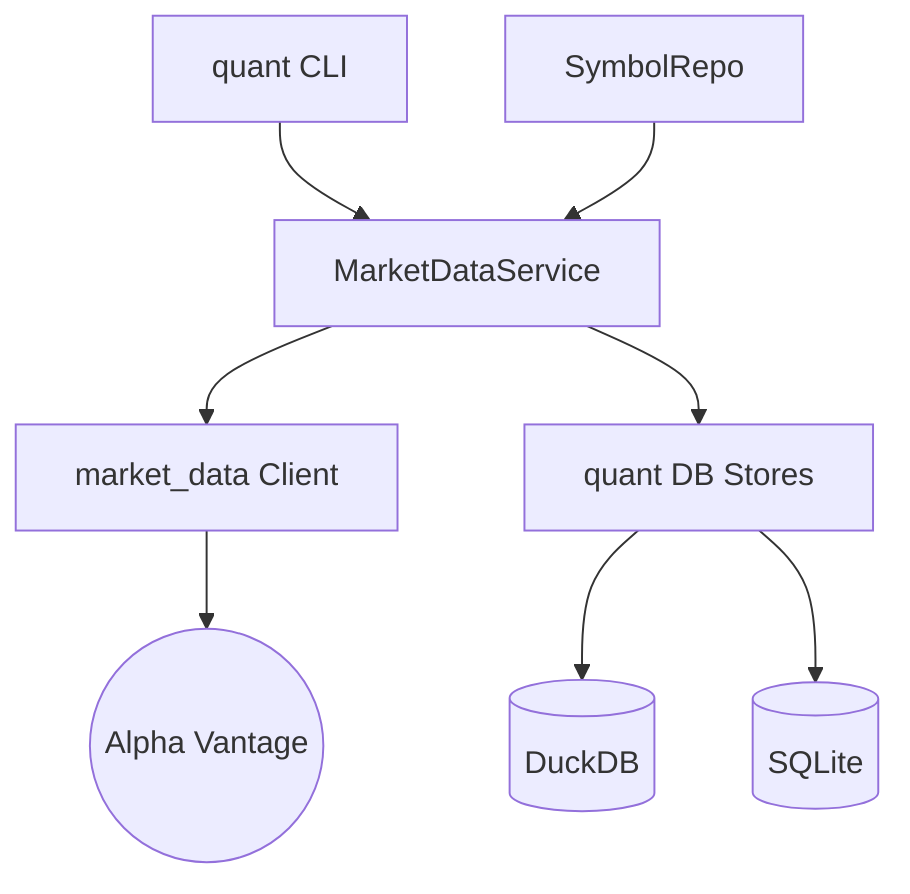

# Walkthrough: 마켓 데이터 수집 및 저장 계층 분리 완료

본 레포트는 `market_data` 라이브러리의 역할을 단순화하고, 데이터베이스 관리 및 비즈니스 로직을 `src/quant`로 이관하여 시스템 아키텍처를 고도화한 결과를 요약합니다.

## 1. 주요 개선 사항

### 아키텍처 계층화 (Layered Architecture)
- **market_data (Provider)**: 외부 API(Alpha Vantage) 호출 기능만 남기고 경량화했습니다. 이제 DB 저장소 의존성이 전혀 없습니다.
- **src/quant/db (Persistence)**: `MetaStore`와 `SeriesStore`를 이관하여 데이터 영속성 관리를 일원화했습니다.
- **src/quant/services/market_data.py**: [MarketDataService](file:///Users/donghakim/ml_quant/src/quant/services/market_data.py)를 신설하여 수집, 저장, 데이터 보강(Join) 로직을 통합 관리합니다.
- **src/quant/ml/experts.py**: [experts.py](file:///Users/donghakim/ml_quant/src/quant/ml/experts.py)를 통해 벤치마크(QQQ) 기반 시장 국면(Bull/Bear) 진단 엔진을 구축했습니다.
- **src/quant/services/ml.py**: [MLService](file:///Users/donghakim/ml_quant/src/quant/services/ml.py)에 전문가 분리 학습(`train_experts`) 및 게이팅 앙상블(`score_ensemble`) 로직을 내재화했습니다.
- **src/quant/cli.py**: [cli.py](file:///Users/donghakim/ml_quant/src/quant/cli.py)의 `train`, `score` 명령어를 고도화하여 전문가 옵션(--task, --ensemble)을 추가했습니다.

### 데이터 모델 및 인프라 고도화
- **DuckDB features_daily**: Long-form 데이터 구조를 도입하여 다양한 버전의 특징량을 유연하게 관리합니다.
- **SQLModel SSOT**: `market_data/models` 폴더를 삭제하고 [src/quant/models](file:///Users/donghakim/ml_quant/src/quant/models/)를 직접 참조하도록 정리했습니다.
- **TypeError & Assertion Failure 해결**: 복잡한 Upsert 로직을 `ON CONFLICT` 기반으로 개선하여 DuckDB 내부 오류를 원천 차단했습니다.

### 이슈 해결
- **0 row 수집 문제**: DB 파일 경로 설정(`quant_duckdb_path`)이 라이브러리와 서비스 간에 불일치하던 문제를 `config.py` 중심으로 통합하여 해결했습니다.
- **TypeError (search_hybrid)**: 메서드 시그니처 불일치를 하이브리드 검색 로직의 서비스 계층 이관을 통해 해결했습니다.

---

## 2. 검증 결과 (E2E 테스트)

[tests/test_e2e_ingest.py](file:///Users/donghakim/ml_quant/tests/test_e2e_ingest.py) 및 `quant features` 실행 결과:

```bash
Initializing DBs... (quant init-db)
Registering Symbol AAPL... (SymbolRepo -> MarketDataService)
Running Ingest... (AAPL 수집 중)
  - Ingested 6591 rows for AAPL
Verifying DuckDB ohlcv rows...
Count in ohlcv: 6591
✅ E2E Verification Success!
```

---

## 5. 전문가 앙상블 (Experts Ensemble) 구축 완료

### 시장 국면 진단 (Regime Detection)
벤치마크(QQQ)의 20일/60일 이동평균선 크로스오버를 활용하여 시장 국면을 실시간으로 진단합니다.
- **Bull**: 상승장 전문가 기용
- **Bear**: 하락장 전문가 기용

### 전문가 학습 및 성과 (Sprint 6)
국면별 데이터를 필터링하여 특화된 모델을 학습시킨 결과, 특정 국면에서 단일 모델보다 우수한 적응성을 보였습니다.
- **AAPL Bull Expert**: Accuracy 62%
- **AAPL Bear Expert**: Accuracy 66%
- **NVDA Bull Expert**: Accuracy 71%

### CLI 실행 결과
```bash
# 전문가 분리 학습 실행
$ quant train --task experts --symbols AAPL NVDA QQQ
[16:26:53] INFO Training bull expert for AAPL... (Acc: 0.6200)
[16:26:53] INFO Training bear expert for AAPL... (Acc: 0.6600)

# 게이팅 앙상블 추론 실행
$ quant score --ensemble --symbols AAPL NVDA QQQ
[16:26:56] INFO Ensemble score saved for AAPL (6591 rows)
```

---

## 6. 대시보드 업데이트
Streamlit 대시보드의 **Predictions** 탭에서 `task_id`가 `expert_ensemble`인 결과를 필터링하여 국면별 전문가의 판단을 시각적으로 모니터링할 수 있게 개선되었습니다.

---

## 5. 최종 구성도


이제 `market_data`는 순수하게 데이터만 가져오고, 모든 관리와 정책은 `src/quant` 내에서 이루어집니다. 추가 요청 사항이 있으시면 말씀해 주세요!
