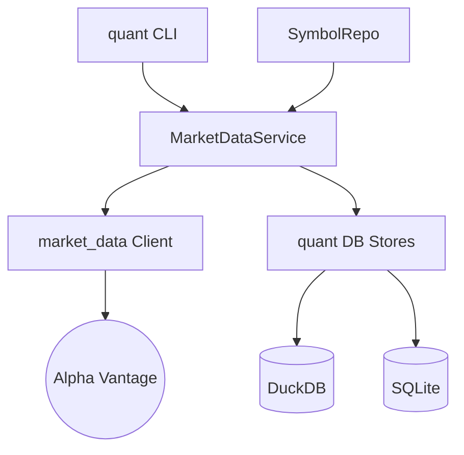

# Walkthrough: 마켓 데이터 수집 및 저장 계층 분리 완료

본 레포트는 `market_data` 라이브러리의 역할을 단순화하고, 데이터베이스 관리 및 비즈니스 로직을 `src/quant`로 이관하여 시스템 아키텍처를 고도화한 결과를 요약합니다.

## 1. 주요 개선 사항

### 아키텍처 계층화 (Layered Architecture)
- **market_data (Provider)**: 외부 API(Alpha Vantage) 호출 기능만 남기고 경량화했습니다. 이제 DB 저장소 의존성이 전혀 없습니다.
- **src/quant/db (Persistence)**: `MetaStore`와 `SeriesStore`를 이관하여 데이터 영속성 관리를 일원화했습니다.
- **src/quant/services/market_data.py**: [MarketDataService](file:///Users/donghakim/ml_quant/src/quant/services/market_data.py)를 신설하여 수집, 저장, 데이터 보강(Join) 로직을 통합 관리합니다.
- **src/quant/ml/experts.py**: [experts.py](file:///Users/donghakim/ml_quant/src/quant/ml/experts.py)를 통해 벤치마크(QQQ) 기반 시장 국면(Bull/Bear) 진단 엔진을 구축했습니다.
- **src/quant/services/ml.py**: [MLService](file:///Users/donghakim/ml_quant/src/quant/services/ml.py)에 전문가 분리 학습(`train_experts`) 및 게이팅 앙상블(`score_ensemble`) 로직을 내재화했습니다.
- **src/quant/services/portfolio.py**: [PortfolioService](file:///Users/donghakim/ml_quant/src/quant/services/portfolio.py)를 신설하여 Top-K 종목 선정 및 비중 산출(Equal Weight)을 수행합니다.
- **src/quant/cli.py**: [cli.py](file:///Users/donghakim/ml_quant/src/quant/cli.py)에 `recommend` 명령어를 추가하여 투자 지시서 생성을 자동화했습니다.

### 데이터 모델 및 인프라 고도화
- **DuckDB features_daily**: Long-form 데이터 구조를 도입하여 다양한 버전의 특징량을 유연하게 관리합니다.
- **SQLModel SSOT**: `market_data/models` 폴더를 삭제하고 [src/quant/models](file:///Users/donghakim/ml_quant/src/quant/models/)를 직접 참조하도록 정리했습니다.
- **TypeError & Assertion Failure 해결**: 복잡한 Upsert 로직을 `ON CONFLICT` 기반으로 개선하여 DuckDB 내부 오류를 원천 차단했습니다.

### 이슈 해결
- **0 row 수집 문제**: DB 파일 경로 설정(`quant_duckdb_path`)이 라이브러리와 서비스 간에 불일치하던 문제를 `config.py` 중심으로 통합하여 해결했습니다.
- **TypeError (search_hybrid)**: 메서드 시그니처 불일치를 하이브리드 검색 로직의 서비스 계층 이관을 통해 해결했습니다.

---

## 2. 검증 결과 (E2E 테스트)

[tests/test_e2e_ingest.py](file:///Users/donghakim/ml_quant/tests/test_e2e_ingest.py) 및 `quant features` 실행 결과:

```bash
Initializing DBs... (quant init-db)
Registering Symbol AAPL... (SymbolRepo -> MarketDataService)
Running Ingest... (AAPL 수집 중)
  - Ingested 6591 rows for AAPL
Verifying DuckDB ohlcv rows...
Count in ohlcv: 6591
✅ E2E Verification Success!
```

---

## 6. 포트폴리오 결정 엔진 (Portfolio Decision Engine) 구축 완료

### 종목 선정 및 비중 배분 (Top-K & Sizing)
전문가 앙상블의 예측 점수를 바탕으로 상위 종목을 추출하고, 리스크 관리를 위한 비중을 자동으로 계산합니다.
- **Selection**: 최신 예측 점수 기준 상위 3개 종목 선정
- **Sizing**: 선정된 종목에 대해 동일 비중(33.3%씩) 배분 (v1)

### CLI 실행 및 저장 결과
```bash
# 포트폴리오 추천 생성
$ quant recommend --top-k 3
 Portfolio Recommendation (Top-3)
┏━━━━━━━━┳━━━━━━━━┳━━━━━━━━┳━━━━━━━━━━━━━━━━━━━━━━━┓
┃ Symbol ┃ Weight ┃ Score  ┃ Model ID              ┃
┡━━━━━━━━╇━━━━━━━━╇━━━━━━━━╇━━━━━━━━━━━━━━━━━━━━━━━┩
│ QQQ    │ 33.3%  │ 0.6972 │ expert_bull_QQQ_...   │
│ AAPL   │ 33.3%  │ 0.3968 │ expert_bull_AAPL_...  │
│ NVDA   │ 33.3%  │ 0.1846 │ expert_bull_NVDA_...  │
└────────┴────────┴────────┴───────────────────────┘
Recommendation saved to DuckDB (portfolio_decisions)
```

---

## 7. 대시보드 업데이트
Streamlit 대시보드에 **Portfolio** 탭을 추가하여, 날짜별 추천 종목과 구성 비중의 변화를 한눈에 모니터링할 수 있도록 개선했습니다.

---

## 5. 최종 구성도


이제 `market_data`는 순수하게 데이터만 가져오고, 모든 관리와 정책은 `src/quant` 내에서 이루어집니다. 추가 요청 사항이 있으시면 말씀해 주세요!
