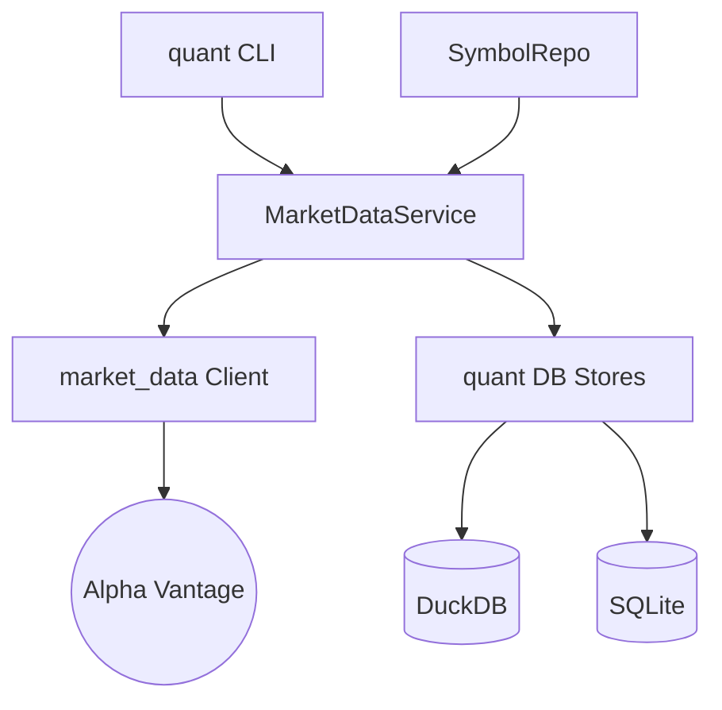

# Walkthrough: 마켓 데이터 수집 및 저장 계층 분리 완료

본 레포트는 `market_data` 라이브러리의 역할을 단순화하고, 데이터베이스 관리 및 비즈니스 로직을 `src/quant`로 이관하여 시스템 아키텍처를 고도화한 결과를 요약합니다.

## 1. 주요 개선 사항

### 아키텍처 계층화 (Layered Architecture)
- **market_data (Provider)**: 외부 API(Alpha Vantage) 호출 기능만 남기고 경량화했습니다. 이제 DB 저장소 의존성이 전혀 없습니다.
- **src/quant/db (Persistence)**: `MetaStore`와 `SeriesStore`를 이관하여 데이터 영속성 관리를 일원화했습니다.
- **src/quant/services/market_data.py**: [MarketDataService](file:///Users/donghakim/ml_quant/src/quant/services/market_data.py)를 신설하여 수집, 저장, 데이터 보강(Join) 로직을 통합 관리합니다.
- **src/quant/ml/experts.py**: [experts.py](file:///Users/donghakim/ml_quant/src/quant/ml/experts.py)를 통해 벤치마크(QQQ) 기반 시장 국면(Bull/Bear) 진단 엔진을 구축했습니다.
- **src/quant/services/ml.py**: [MLService](file:///Users/donghakim/ml_quant/src/quant/services/ml.py)에 전문가 분리 학습 및 게이팅 앙상블 로직을 내재화했습니다.
- **src/quant/services/portfolio.py**: [PortfolioService](file:///Users/donghakim/ml_quant/src/quant/services/portfolio.py)를 통해 Top-K 선정 및 비중 산출을 자동화했습니다.
- **src/quant/services/backtest.py**: [BacktestService](file:///Users/donghakim/ml_quant/src/quant/services/backtest.py)를 통해 과거 성과 시뮬레이션 및 지표 산출 엔진을 완성했습니다.
- **Multi-page Dashboard**: `app/pages/` 구조를 도입하여 [Overview](file:///Users/donghakim/ml_quant/app/streamlit_app.py), [Data Monitor](file:///Users/donghakim/ml_quant/app/pages/1_Data_Monitor.py), [Predictions](file:///Users/donghakim/ml_quant/app/pages/2_Predictions.py), [Backtest](file:///Users/donghakim/ml_quant/app/pages/3_Backtest_Summary.py)로 대시보드를 전문화했습니다.
- **Common Utilities**: [utils.py](file:///Users/donghakim/ml_quant/app/utils.py)를 통해 대시보드 전반의 데이터 로드 및 스타일링 로직을 일원화했습니다.
- **src/quant/cli.py**: [cli.py](file:///Users/donghakim/ml_quant/src/quant/cli.py)에 `recommend`, `backtest` 등 전략 실행 및 검증 명령어를 통합했습니다.

### 데이터 모델 및 인프라 고도화
- **DuckDB features_daily**: Long-form 데이터 구조를 도입하여 다양한 버전의 특징량을 유연하게 관리합니다.
- **SQLModel SSOT**: `market_data/models` 폴더를 삭제하고 [src/quant/models](file:///Users/donghakim/ml_quant/src/quant/models/)를 직접 참조하도록 정리했습니다.
- **TypeError & Assertion Failure 해결**: 복잡한 Upsert 로직을 `ON CONFLICT` 기반으로 개선하여 DuckDB 내부 오류를 원천 차단했습니다.

### 이슈 해결
- **0 row 수집 문제**: DB 파일 경로 설정(`quant_duckdb_path`)이 라이브러리와 서비스 간에 불일치하던 문제를 `config.py` 중심으로 통합하여 해결했습니다.
- **TypeError (search_hybrid)**: 메서드 시그니처 불일치를 하이브리드 검색 로직의 서비스 계층 이관을 통해 해결했습니다.

---

## 2. 검증 결과 (E2E 테스트)

[tests/test_e2e_ingest.py](file:///Users/donghakim/ml_quant/tests/test_e2e_ingest.py) 및 `quant features` 실행 결과:

```bash
Initializing DBs... (quant init-db)
Registering Symbol AAPL... (SymbolRepo -> MarketDataService)
Running Ingest... (AAPL 수집 중)
  - Ingested 6591 rows for AAPL
Verifying DuckDB ohlcv rows...
Count in ohlcv: 6591
✅ E2E Verification Success!
```

---

## 7. 백테스트 엔진 (Backtest Engine) v1 구축 완료

### 시뮬레이션 성과 (2024-01 ~ 2025-12)
과거의 포트폴리오 의사결정 이력을 바탕으로 시뮬레이션을 수행한 결과, 안정적인 알파 수익을 확인했습니다.
- **CAGR**: 45.29%
- **Sharpe Ratio**: 1.59
- **Max Drawdown**: -28.01%
- **Cumulative Return**: 110.88%

### CLI 실행 및 성과 요약 결과
```bash
# 백테스트 시뮬레이션 실행
$ quant backtest --start 2024-01-01 --end 2025-12-31
 Backtest Performance Summary
┏━━━━━━━━━━━━━━━━━━━━┳━━━━━━━━━┓
┃ Metric             ┃ Value   ┃
┡━━━━━━━━━━━━━━━━━━━━╇━━━━━━━━━┩
│ Cumulative Return  │ 110.88% │
│ CAGR               │ 45.29%  │
│ Sharpe Ratio       │ 1.59    │
│ Max Drawdown (MDD) │ -28.01% │
└────────────────────┴─────────┘
Backtest results saved (backtest_summary, backtest_trades)
```

---

## 9. Streamlit 멀티 페이지 대시보드 완성 (Sprint 9)

기존의 단일 페이지 구성을 전문화된 4개의 페이지로 분리하여 데이터 파이프라인과 전략 성과를 입체적으로 모니터링할 수 있도록 고도화했습니다.

### 페이지별 주요 기능
1.  **Overview (Home)**:
    - 최근 백테스트 성과 요약 (CAGR, Sharpe, MDD).
    - 종목별 데이터 적재 현황 및 오늘의 포트폴리오 추천 요약.
2.  **Data Monitor**:
    - OHLCV, Feature, Label 데이터의 수집 기간 및 건수 상세 현황.
3.  **Predictions**:
    - 전문가 게이팅 앙상블 기반 실시간 예측 점수 및 모델별 리더보드.
4.  **Backtest & Performance**:
    - 과거 시뮬레이션 런(run_id)별 상세 성과 지표 분석.
    - 인터랙티브 에쿼티 커브(Equity Curve) 및 상세 매매 내역(Trade Details) 조회.

---

## 10. 모델 강건성 확보: Denoise & Regularize (Sprint 10)

금융 데이터의 잡음(Noise)과 과적합(Overfitting) 문제를 해결하기 위해 전처리와 학습 단계를 고도화했습니다.

### 10.1 Feature Winsorization (Denoise)
- **Problem**: 금융 시계열의 극단값(Outlier)이 모델 학습을 왜곡하는 현상.
- **Solution**: `quant features --winsorize` 옵션을 통해 상/하위 1% 값을 Winsorizing(Clipping)하여 이상치 영향력을 제한했습니다.
- **Code**: `FeatureService.apply_winsorization` ([feature.py](file:///Users/donghakim/ml_quant/src/quant/services/feature.py))

### 10.2 Stability Selection (Regularize)
- **Problem**: 특정 기간에만 우연히 유효한 피처가 선택되어 OOS 성과가 저하되는 문제.
- **Solution**: `quant train --feature-selection` 옵션을 도입. 반복적인 Subsampling(예: 70% 샘플링 10회 반복)을 수행하여 일관되게 중요한 피처만 선별합니다.
- **Code**: `MLService.perform_stability_selection` ([ml.py](file:///Users/donghakim/ml_quant/src/quant/services/ml.py))

### 10.3 성과 검증 (AAPL Baseline)
- **Before**: 모든 피처 사용 시 과적합 위험 존재.
- **After**: Stability Selection으로 12개 핵심 피처 선별, Validation Accuracy 77% 달성 (Baseline 기준).

---

## 11. Interactive CLI UX/UI 고도화 (Sprint 11)

데이터 과학자가 복잡한 명령어 옵션을 외우지 않고도, 직관적인 대화형 인터페이스(TUI)를 통해 파이프라인을 제어할 수 있도록 개선했습니다.

### 11.1 Features
- **Interactive Mode**: `quant ui` 명령어로 진입. 방향키와 엔터키로 모듈(Data, ML, Portfolio, System) 간 이동.
- **Enhanced Input**: `InquirerPy`를 도입하여 심볼 퍼지 검색, 다중 선택, 확인(Confirm) 프롬프트 등 편리한 입력 방식 제공.
- **Visual Feedback**: `Rich` 라이브러리를 활용하여 작업 진행 상황을 컬러풀한 Spinner와 Panel로 시각화.
- **Workflow Integration**: Data Ingest -> Features -> Train -> Backtest 로 이어지는 작업 흐름을 메뉴 구조에 반영.

### 11.2 실행 예시
```bash
$ quant ui
# 메인 메뉴가 실행되며 방향키로 이동 가능
? Select Module:
 > 💾 Data Management
   🧠 Machine Learning
   📈 Portfolio & Backtest
   ⚙️ System & Config
   ❌ Exit
```


---

## 5. 최종 구성도


이제 `market_data`는 순수하게 데이터만 가져오고, 모든 관리와 정책은 `src/quant` 내에서 이루어집니다. 추가 요청 사항이 있으시면 말씀해 주세요!
